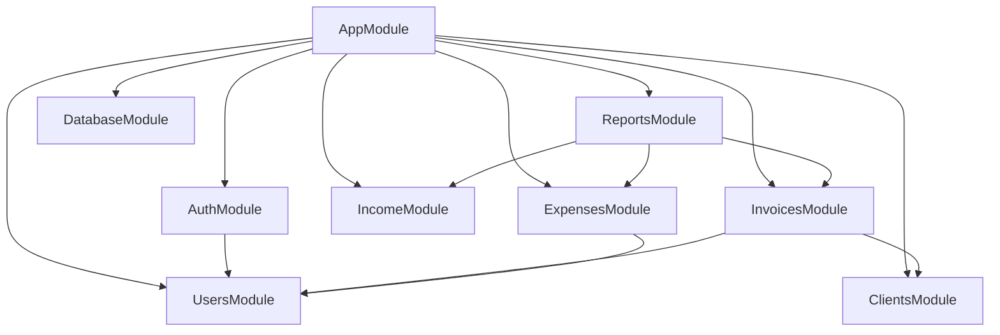
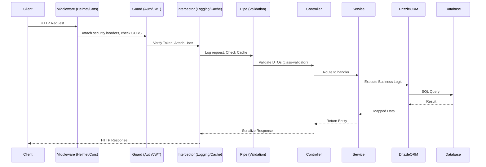
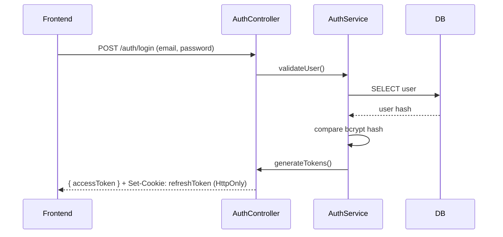
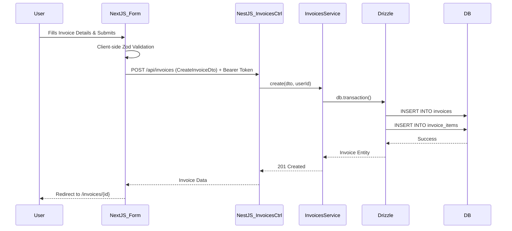
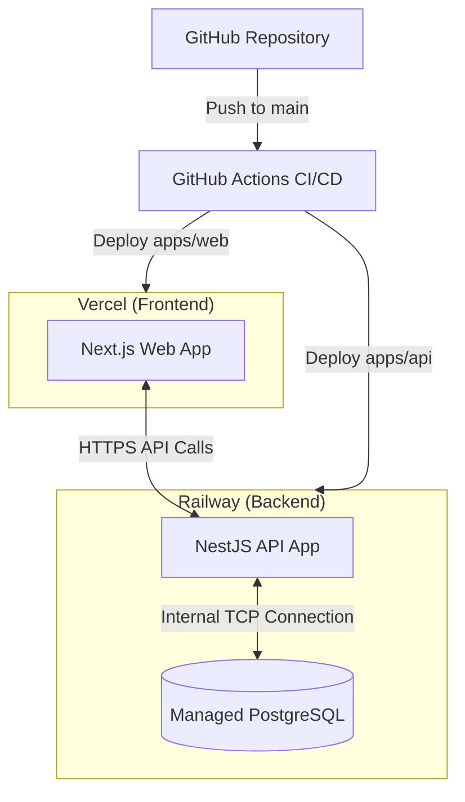

# System Architecture

## 1. Architecture Overview

FreelancerHisab has transitioned from a monolithic Next.js architecture to a decoupled monorepo architecture using Turborepo. This separates the backend logic into a dedicated NestJS API and the frontend into a Next.js App Router application. Both applications share types, contracts, and validation schemas through a shared package.

```mermaid
graph TD
    subgraph Client
        Browser[Web Browser / PWA]
    end

    subgraph Frontend["Vercel (Frontend)"]
        NextJS[Next.js 14 App Router]
        RSC[React Server Components]
        CC[Client Components]
        NextJS --> RSC
        NextJS --> CC
    end

    subgraph Backend["Railway (Backend & DB)"]
        NestJS[NestJS 10 API]
        PostgreSQL[(PostgreSQL)]
    end

    subgraph Monorepo["Turborepo Workspace"]
        SharedPackages[packages/shared<br/>Types, Zod Schemas, API Contracts]
    end

    Browser <-->|HTTPS / REST| NextJS
    Browser <-->|HTTPS / REST (Client Fetch)| NestJS
    RSC <-->|HTTPS / REST| NestJS
    NestJS <-->|TCP (Postgres.js / Drizzle)| PostgreSQL

    SharedPackages -.->|Imported by| NextJS
    SharedPackages -.->|Imported by| NestJS
```

## 2. Architecture Principles

The decision to migrate to a decoupled NestJS + Next.js architecture within a Turborepo monorepo was driven by the following principles:

-   **Separation of Concerns**: Decoupling the frontend presentation layer (Next.js) from complex backend business logic (NestJS).
-   **Backend Modularity**: NestJS enforces a strict modular architecture (Modules, Controllers, Services), making it easier to scale the team and maintain the codebase as domain complexity grows compared to Next.js API routes.
-   **Type Safety across Boundaries**: Using `packages/shared`, we maintain end-to-end type safety. API responses and request payloads defined in NestJS are strictly typed in the Next.js client.
-   **Optimal Hosting**: Next.js is optimized for Vercel (Edge network, specialized caching), while long-running Node.js processes, background tasks, and database connections (NestJS) run more reliably and cost-effectively on Railway.
-   **Performance**: Shifting from Prisma to Drizzle ORM provides a leaner, edge-compatible ORM with explicit SQL-like queries, preventing N+1 issues common in complex Prisma relations.

## 3. Technology Stack Deep-Dive

### Backend (apps/api)
-   **Framework**: NestJS 10+ with TypeScript.
-   **Modular Structure**:
    -   `AuthModule`: User registration, login, JWT issuance, and refresh.
    -   `ClientsModule`: Client lifecycle management.
    -   `InvoicesModule`: Invoice generation, line items, status tracking (draft, sent, paid, overdue).
    -   `IncomeModule`: Tracking standalone payments.
    -   `ExpensesModule`: Expense tracking, categorizations.
    -   `ReportsModule`: Aggregating data for dashboard charts and financial summaries.
-   **Pattern**: Controller (HTTP handling) → Service (Business Logic) → Repository/Service (Data Access).
-   **Database & ORM**: PostgreSQL database. Drizzle ORM with `postgres.js` driver for fast, type-safe queries.
-   **Authentication**: Passport.js integrated with JWT strategies. Issues short-lived access tokens (15m) and HTTP-only refresh tokens (7d).
-   **Validation**: `class-validator` and `class-transformer` for DTO (Data Transfer Object) validation in NestJS pipes.
-   **Documentation**: `@nestjs/swagger` for auto-generating OpenAPI documentation (`/api/docs`).
-   **File Management**: Multer for handling receipt and logo uploads (temporarily local, transitioning to S3/Cloudinary).
-   **Emailing**: Integration with Resend for sending invoices and receipts.

### Frontend (apps/web)
-   **Framework**: Next.js 14+ utilizing the App Router (`app/`).
-   **Data Loading**: React Server Components (RSC) for initial page loads and SEO-critical data.
-   **Client State & Fetching**: TanStack Query (React Query) for client-side data fetching, caching, and mutations against the NestJS API. Zustand for lightweight global UI state (e.g., sidebar toggles, theme).
-   **Forms**: React Hook Form combined with Zod for robust client-side validation.
-   **Styling**: Tailwind CSS and `shadcn/ui` for a highly customizable, accessible component library.

### Shared Package (packages/shared)
-   **Contents**: TypeScript interfaces, enums, DTOs, and Zod schemas.
-   **Usage**: Both `apps/api` and `apps/web` depend on `packages/shared`. When a DTO changes in the API, the frontend immediately sees the type update, preventing contract drift.

## 4. Application Architecture

### NestJS Module Dependency Graph



### Request Lifecycle in NestJS



### Next.js Rendering & Fetching Strategy

- **RSC (React Server Components)**: Used for `/dashboard`, `/invoices`, etc., to fetch initial data securely from the NestJS API using server-side `fetch` (with forwarded auth tokens).
- **Client Components**: Used for interactive tables (DataTables), forms (Create Invoice), and TanStack Query mutations.

## 5. Data Flow Diagrams

### Authentication Flow (JWT)



### Invoice Creation Flow



## 6. Security Architecture

- **Authentication**: JWT-based.
  - Access Tokens: Short-lived (15 minutes), sent via `Authorization: Bearer <token>` header.
  - Refresh Tokens: Long-lived (7 days), stored in secure, `HttpOnly`, `SameSite=Strict` cookies to prevent XSS.
- **CORS**: NestJS configured to strictly accept cross-origin requests only from the specified Next.js frontend URLs (e.g., `https://app.freelancerhisab.pk`).
- **Rate Limiting**: `@nestjs/throttler` applied globally to prevent brute-force and DDoS attacks. Stricter limits on `/auth` endpoints.
- **Input Validation**: All incoming payloads validated via `class-validator` DTOs. Unrecognized fields are stripped (`whitelist: true`).
- **Headers**: Helmet middleware applied in NestJS for standard HTTP security headers (X-Frame-Options, HSTS, X-XSS-Protection).

## 7. Performance Strategy

- **Next.js Rendering**: Use Server Components to drastically reduce client-side JavaScript bundle sizes.
- **API Caching**: NestJS `@nestjs/cache-manager` caches expensive dashboard aggregate queries (e.g., monthly income reports) for up to 5 minutes using in-memory caching (can be upgraded to Redis).
- **Database Optimization**: Drizzle ORM provides predictable SQL execution. Complex queries (e.g., fetching invoices with their client and line items) use Drizzle's relational queries optimized for single-trip execution.
- **Connection Pooling**: `postgres.js` driver handles connection pooling to ensure the DB isn't overwhelmed by concurrent NestJS requests.

## 8. Error Handling Strategy

- **NestJS Global Exception Filter**: A custom `AllExceptionsFilter` catches uncaught exceptions, logs them internally, and returns a standardized JSON structure to the client:
  ```json
  {
    "statusCode": 400,
    "timestamp": "2024-01-01T12:00:00.000Z",
    "path": "/api/invoices",
    "message": ["amount must be a positive number"],
    "error": "Bad Request"
  }
  ```
- **Next.js Error Boundaries**: `error.tsx` boundaries wrap route segments to gracefully catch RSC failures and display fallback UI without crashing the app.
- **API Client Interceptor**: The frontend Axios/Fetch wrapper catches 401 Unauthorized errors to automatically trigger a silent refresh token flow before retrying the original request.

## 9. Deployment Architecture



- **Turborepo Pipeline**: Remote caching is utilized during CI/CD to speed up linting, testing, and building of unaffected apps/packages.
- **Vercel**: Hosts `apps/web`. Vercel automatically detects the Next.js app within the monorepo.
- **Railway**: Hosts `apps/api` (Dockerfile/Nixpacks) and the PostgreSQL database. Variables like `DATABASE_URL` and `JWT_SECRET` are managed within Railway environments.

## 10. Communication Between Services

- **Next.js API Client**: A centralized `apiClient.ts` wrapper (using Axios or native Fetch) resides in `apps/web/lib/api`. It manages the base URL (`NEXT_PUBLIC_API_URL`) and automatically injects the Access Token into headers.
- **Token Management**: The client intercepts `401 Unauthorized` responses. If a request fails due to an expired access token, the client calls `/auth/refresh` (which uses the HttpOnly cookie), retrieves a new access token, updates its store, and replays the failed request.
- **Environment Configuration**:
  - Local: `NEXT_PUBLIC_API_URL=http://localhost:3001`
  - Production: `NEXT_PUBLIC_API_URL=https://api.freelancerhisab.pk`
