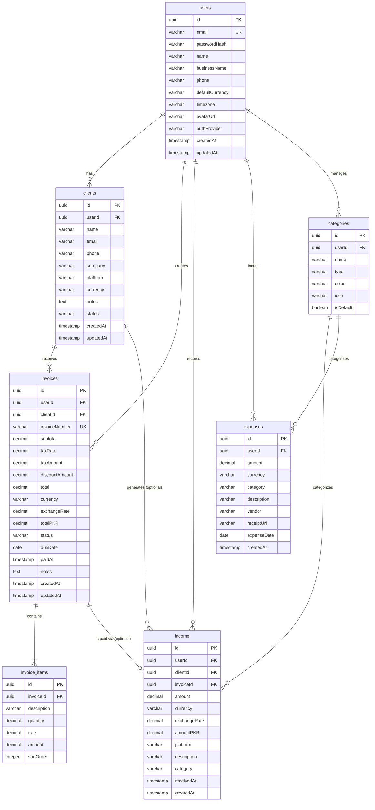

# Database Design

This document details the relational database schema for FreelancerHissab, designed using **PostgreSQL** and **Drizzle ORM** (`postgres.js` driver) inside a Turborepo monorepo architecture. 

The database lives in the NestJS backend at `apps/api/src/database/` and types are exported to `packages/shared/` for use across the stack.

## 1. Entity-Relationship Diagram



## 2. Complete Drizzle Schema & Relations

The schema is divided into multiple files inside `apps/api/src/database/schema/`.

### `apps/api/src/database/schema/enums.ts`
```typescript
import { pgEnum } from 'drizzle-orm/pg-core';

export const authProviderEnum = pgEnum('auth_provider', ['credentials', 'google']);
export const clientPlatformEnum = pgEnum('client_platform', ['upwork', 'fiverr', 'freelancer', 'direct', 'other']);
export const clientStatusEnum = pgEnum('client_status', ['active', 'archived']);
export const invoiceStatusEnum = pgEnum('invoice_status', ['draft', 'sent', 'viewed', 'paid', 'overdue', 'cancelled']);
export const categoryTypeEnum = pgEnum('category_type', ['income', 'expense']);
export const expenseCategoryEnum = pgEnum('expense_category', ['software', 'hardware', 'internet', 'office', 'travel', 'food', 'marketing', 'education', 'tax', 'other']);
```

### `apps/api/src/database/schema/users.ts`
```typescript
import { pgTable, uuid, varchar, timestamp, uniqueIndex } from 'drizzle-orm/pg-core';
import { relations } from 'drizzle-orm';
import { authProviderEnum } from './enums';
import { clients, invoices, income, expenses, categories } from './index';

export const users = pgTable('users', {
  id: uuid('id').defaultRandom().primaryKey(),
  email: varchar('email', { length: 255 }).notNull(),
  passwordHash: varchar('password_hash', { length: 255 }),
  name: varchar('name', { length: 255 }).notNull(),
  businessName: varchar('business_name', { length: 255 }),
  phone: varchar('phone', { length: 50 }),
  defaultCurrency: varchar('default_currency', { length: 3 }).default('PKR').notNull(),
  timezone: varchar('timezone', { length: 100 }).default('Asia/Karachi').notNull(),
  avatarUrl: varchar('avatar_url', { length: 500 }),
  authProvider: authProviderEnum('auth_provider').default('credentials').notNull(),
  createdAt: timestamp('created_at').defaultNow().notNull(),
  updatedAt: timestamp('updated_at').defaultNow().notNull(),
}, (table) => {
  return {
    emailIdx: uniqueIndex('user_email_idx').on(table.email),
  };
});

export const usersRelations = relations(users, ({ many }) => ({
  clients: many(clients),
  invoices: many(invoices),
  income: many(income),
  expenses: many(expenses),
  categories: many(categories),
}));
```

### `apps/api/src/database/schema/clients.ts`
```typescript
import { pgTable, uuid, varchar, text, timestamp, index } from 'drizzle-orm/pg-core';
import { relations } from 'drizzle-orm';
import { clientPlatformEnum, clientStatusEnum } from './enums';
import { users } from './users';
import { invoices } from './invoices';
import { income } from './income';

export const clients = pgTable('clients', {
  id: uuid('id').defaultRandom().primaryKey(),
  userId: uuid('user_id').notNull().references(() => users.id, { onDelete: 'cascade' }),
  name: varchar('name', { length: 255 }).notNull(),
  email: varchar('email', { length: 255 }),
  phone: varchar('phone', { length: 50 }),
  company: varchar('company', { length: 255 }),
  platform: clientPlatformEnum('platform').default('direct').notNull(),
  currency: varchar('currency', { length: 3 }).default('USD').notNull(),
  notes: text('notes'),
  status: clientStatusEnum('status').default('active').notNull(),
  createdAt: timestamp('created_at').defaultNow().notNull(),
  updatedAt: timestamp('updated_at').defaultNow().notNull(),
}, (table) => {
  return {
    userIdIdx: index('client_user_id_idx').on(table.userId),
  };
});

export const clientsRelations = relations(clients, ({ one, many }) => ({
  user: one(users, {
    fields: [clients.userId],
    references: [users.id],
  }),
  invoices: many(invoices),
  income: many(income),
}));
```

### `apps/api/src/database/schema/invoices.ts`
```typescript
import { pgTable, uuid, varchar, text, timestamp, decimal, date, index, uniqueIndex } from 'drizzle-orm/pg-core';
import { relations } from 'drizzle-orm';
import { invoiceStatusEnum } from './enums';
import { users } from './users';
import { clients } from './clients';
import { invoiceItems } from './invoice-items';
import { income } from './income';

export const invoices = pgTable('invoices', {
  id: uuid('id').defaultRandom().primaryKey(),
  userId: uuid('user_id').notNull().references(() => users.id, { onDelete: 'cascade' }),
  clientId: uuid('client_id').notNull().references(() => clients.id, { onDelete: 'cascade' }),
  invoiceNumber: varchar('invoice_number', { length: 50 }).notNull(),
  subtotal: decimal('subtotal', { precision: 12, scale: 2 }).notNull().default('0'),
  taxRate: decimal('tax_rate', { precision: 5, scale: 2 }).notNull().default('0'),
  taxAmount: decimal('tax_amount', { precision: 12, scale: 2 }).notNull().default('0'),
  discountAmount: decimal('discount_amount', { precision: 12, scale: 2 }).notNull().default('0'),
  total: decimal('total', { precision: 12, scale: 2 }).notNull().default('0'),
  currency: varchar('currency', { length: 3 }).default('USD').notNull(),
  exchangeRate: decimal('exchange_rate', { precision: 10, scale: 4 }).default('1').notNull(),
  totalPKR: decimal('total_pkr', { precision: 12, scale: 2 }).notNull().default('0'),
  status: invoiceStatusEnum('status').default('draft').notNull(),
  dueDate: date('due_date'),
  paidAt: timestamp('paid_at'),
  notes: text('notes'),
  createdAt: timestamp('created_at').defaultNow().notNull(),
  updatedAt: timestamp('updated_at').defaultNow().notNull(),
}, (table) => {
  return {
    userIdIdx: index('invoice_user_id_idx').on(table.userId),
    clientIdIdx: index('invoice_client_id_idx').on(table.clientId),
    invoiceNumberUserIdIdx: uniqueIndex('invoice_num_user_idx').on(table.invoiceNumber, table.userId),
  };
});

export const invoicesRelations = relations(invoices, ({ one, many }) => ({
  user: one(users, { fields: [invoices.userId], references: [users.id] }),
  client: one(clients, { fields: [invoices.clientId], references: [clients.id] }),
  items: many(invoiceItems),
  income: many(income),
}));
```

### `apps/api/src/database/schema/invoice-items.ts`
```typescript
import { pgTable, uuid, varchar, decimal, integer, index } from 'drizzle-orm/pg-core';
import { relations } from 'drizzle-orm';
import { invoices } from './invoices';

export const invoiceItems = pgTable('invoice_items', {
  id: uuid('id').defaultRandom().primaryKey(),
  invoiceId: uuid('invoice_id').notNull().references(() => invoices.id, { onDelete: 'cascade' }),
  description: varchar('description', { length: 500 }).notNull(),
  quantity: decimal('quantity', { precision: 10, scale: 2 }).notNull().default('1'),
  rate: decimal('rate', { precision: 12, scale: 2 }).notNull().default('0'),
  amount: decimal('amount', { precision: 12, scale: 2 }).notNull().default('0'),
  sortOrder: integer('sort_order').notNull().default(0),
}, (table) => {
  return {
    invoiceIdIdx: index('invoice_item_invoice_id_idx').on(table.invoiceId),
  };
});

export const invoiceItemsRelations = relations(invoiceItems, ({ one }) => ({
  invoice: one(invoices, {
    fields: [invoiceItems.invoiceId],
    references: [invoices.id],
  }),
}));
```

### `apps/api/src/database/schema/income.ts`
```typescript
import { pgTable, uuid, varchar, timestamp, decimal, index } from 'drizzle-orm/pg-core';
import { relations } from 'drizzle-orm';
import { clientPlatformEnum } from './enums';
import { users } from './users';
import { clients } from './clients';
import { invoices } from './invoices';

export const income = pgTable('income', {
  id: uuid('id').defaultRandom().primaryKey(),
  userId: uuid('user_id').notNull().references(() => users.id, { onDelete: 'cascade' }),
  clientId: uuid('client_id').references(() => clients.id, { onDelete: 'set null' }),
  invoiceId: uuid('invoice_id').references(() => invoices.id, { onDelete: 'set null' }),
  amount: decimal('amount', { precision: 12, scale: 2 }).notNull(),
  currency: varchar('currency', { length: 3 }).default('USD').notNull(),
  exchangeRate: decimal('exchange_rate', { precision: 10, scale: 4 }).default('1').notNull(),
  amountPKR: decimal('amount_pkr', { precision: 12, scale: 2 }).notNull(),
  platform: clientPlatformEnum('platform').default('direct').notNull(),
  description: varchar('description', { length: 500 }).notNull(),
  category: varchar('category', { length: 100 }),
  receivedAt: timestamp('received_at').defaultNow().notNull(),
  createdAt: timestamp('created_at').defaultNow().notNull(),
}, (table) => {
  return {
    userIdIdx: index('income_user_id_idx').on(table.userId),
    clientIdIdx: index('income_client_id_idx').on(table.clientId),
    invoiceIdIdx: index('income_invoice_id_idx').on(table.invoiceId),
  };
});

export const incomeRelations = relations(income, ({ one }) => ({
  user: one(users, { fields: [income.userId], references: [users.id] }),
  client: one(clients, { fields: [income.clientId], references: [clients.id] }),
  invoice: one(invoices, { fields: [income.invoiceId], references: [invoices.id] }),
}));
```

### `apps/api/src/database/schema/expenses.ts`
```typescript
import { pgTable, uuid, varchar, timestamp, decimal, date, index } from 'drizzle-orm/pg-core';
import { relations } from 'drizzle-orm';
import { expenseCategoryEnum } from './enums';
import { users } from './users';

export const expenses = pgTable('expenses', {
  id: uuid('id').defaultRandom().primaryKey(),
  userId: uuid('user_id').notNull().references(() => users.id, { onDelete: 'cascade' }),
  amount: decimal('amount', { precision: 12, scale: 2 }).notNull(),
  currency: varchar('currency', { length: 3 }).default('PKR').notNull(),
  category: expenseCategoryEnum('category').default('other').notNull(),
  description: varchar('description', { length: 500 }).notNull(),
  vendor: varchar('vendor', { length: 255 }),
  receiptUrl: varchar('receipt_url', { length: 1000 }),
  expenseDate: date('expense_date').notNull(),
  createdAt: timestamp('created_at').defaultNow().notNull(),
}, (table) => {
  return {
    userIdIdx: index('expense_user_id_idx').on(table.userId),
  };
});

export const expensesRelations = relations(expenses, ({ one }) => ({
  user: one(users, { fields: [expenses.userId], references: [users.id] }),
}));
```

### `apps/api/src/database/schema/categories.ts`
```typescript
import { pgTable, uuid, varchar, boolean, index } from 'drizzle-orm/pg-core';
import { relations } from 'drizzle-orm';
import { categoryTypeEnum } from './enums';
import { users } from './users';

export const categories = pgTable('categories', {
  id: uuid('id').defaultRandom().primaryKey(),
  userId: uuid('user_id').notNull().references(() => users.id, { onDelete: 'cascade' }),
  name: varchar('name', { length: 100 }).notNull(),
  type: categoryTypeEnum('type').notNull(),
  color: varchar('color', { length: 7 }).default('#000000'),
  icon: varchar('icon', { length: 50 }),
  isDefault: boolean('is_default').default(false).notNull(),
}, (table) => {
  return {
    userIdIdx: index('category_user_id_idx').on(table.userId),
  };
});

export const categoriesRelations = relations(categories, ({ one }) => ({
  user: one(users, { fields: [categories.userId], references: [users.id] }),
}));
```

### `apps/api/src/database/schema/index.ts` (Barrel Export)
```typescript
export * from './enums';
export * from './users';
export * from './clients';
export * from './invoices';
export * from './invoice-items';
export * from './income';
export * from './expenses';
export * from './categories';
```

## 6. Database Configuration

### `apps/api/src/database/db.ts`
```typescript
import { drizzle } from 'drizzle-orm/postgres-js';
import postgres from 'postgres';
import * as schema from './schema';
import { config } from 'dotenv';

config(); // Load environment variables

const connectionString = process.env.DATABASE_URL;

if (!connectionString) {
  throw new Error('DATABASE_URL environment variable is missing');
}

// Disable prefetch as it is not supported for "Transaction" pool mode
const client = postgres(connectionString, { prepare: false });
export const db = drizzle(client, { schema });
```

## 7. Drizzle Config

### `apps/api/drizzle.config.ts`
```typescript
import { defineConfig } from 'drizzle-kit';
import * as dotenv from 'dotenv';

dotenv.config();

export default defineConfig({
  schema: './src/database/schema/index.ts',
  out: './src/database/migrations',
  driver: 'pg',
  dbCredentials: {
    connectionString: process.env.DATABASE_URL as string,
  },
  verbose: true,
  strict: true,
});
```

## 8. Migration Strategy

We use `drizzle-kit` for generating and running migrations.

Add these scripts to `apps/api/package.json`:
```json
"scripts": {
  "db:generate": "drizzle-kit generate:pg",
  "db:push": "drizzle-kit push:pg",
  "db:studio": "drizzle-kit studio",
  "db:migrate": "tsx src/database/migrate.ts",
  "db:seed": "tsx src/database/seed.ts"
}
```

### `apps/api/src/database/migrate.ts`
```typescript
import { drizzle } from 'drizzle-orm/postgres-js';
import { migrate } from 'drizzle-orm/postgres-js/migrator';
import postgres from 'postgres';
import * as dotenv from 'dotenv';

dotenv.config();

const runMigrate = async () => {
  if (!process.env.DATABASE_URL) {
    throw new Error('DATABASE_URL is not defined');
  }

  const migrationClient = postgres(process.env.DATABASE_URL, { max: 1 });
  const db = drizzle(migrationClient);

  console.log('Running migrations...');
  await migrate(db, { migrationsFolder: './src/database/migrations' });
  console.log('Migrations complete!');
  
  process.exit(0);
};

runMigrate().catch((err) => {
  console.error('Migration failed!', err);
  process.exit(1);
});
```

## 9. Seed Script

### `apps/api/src/database/seed.ts`
```typescript
import { db } from './db';
import { users, clients, invoices, income, expenses } from './schema';

async function seed() {
  console.log('Seeding database with Pakistani context data...');

  // 1. Create User
  const [user] = await db.insert(users).values({
    email: 'ahmed.dev@example.com',
    passwordHash: '$2b$10$Ep9...', // bcrypt hash for 'password123'
    name: 'Ahmed Ali',
    businessName: 'Ahmed Web Solutions',
    phone: '+923001234567',
    defaultCurrency: 'PKR',
    timezone: 'Asia/Karachi',
  }).returning();

  // 2. Create Clients
  const [client] = await db.insert(clients).values({
    userId: user.id,
    name: 'TechFlow Inc.',
    email: 'billing@techflow.com',
    platform: 'upwork',
    currency: 'USD',
  }).returning();

  // 3. Create Invoice
  const [invoice] = await db.insert(invoices).values({
    userId: user.id,
    clientId: client.id,
    invoiceNumber: 'FH-2024-0001',
    subtotal: '1000.00',
    total: '1000.00',
    currency: 'USD',
    exchangeRate: '280.50',
    totalPKR: '280500.00',
    status: 'paid',
    dueDate: '2024-02-15',
  }).returning();

  // 4. Create Income (Bank Transfer/Payoneer/JazzCash)
  await db.insert(income).values({
    userId: user.id,
    clientId: client.id,
    invoiceId: invoice.id,
    amount: '1000.00',
    currency: 'USD',
    exchangeRate: '280.50',
    amountPKR: '280500.00',
    platform: 'upwork',
    description: 'Upwork Withdrawal to Meezan Bank',
  });

  // 5. Create Expenses (PTCL, Nayatel, Co-working space)
  await db.insert(expenses).values({
    userId: user.id,
    amount: '4500.00',
    currency: 'PKR',
    category: 'internet',
    description: 'Nayatel Monthly Bill',
    vendor: 'Nayatel',
    expenseDate: '2024-02-10',
  });

  console.log('Seed completed successfully!');
  process.exit(0);
}

seed().catch(console.error);
```

## 10. Type Inference for Shared Packages

We export Drizzle inferred types to a shared package so the Next.js frontend can use them.

### `packages/shared/src/types/models.ts`
```typescript
import { InferSelectModel, InferInsertModel } from 'drizzle-orm';
import { 
  users, 
  clients, 
  invoices, 
  invoiceItems,
  income,
  expenses,
  categories
} from 'api/src/database/schema';

// User Types
export type User = InferSelectModel<typeof users>;
export type NewUser = InferInsertModel<typeof users>;

// Client Types
export type Client = InferSelectModel<typeof clients>;
export type NewClient = InferInsertModel<typeof clients>;

// Invoice Types
export type Invoice = InferSelectModel<typeof invoices>;
export type NewInvoice = InferInsertModel<typeof invoices>;

// Invoice Item Types
export type InvoiceItem = InferSelectModel<typeof invoiceItems>;
export type NewInvoiceItem = InferInsertModel<typeof invoiceItems>;

// Income Types
export type Income = InferSelectModel<typeof income>;
export type NewIncome = InferInsertModel<typeof income>;

// Expense Types
export type Expense = InferSelectModel<typeof expenses>;
export type NewExpense = InferInsertModel<typeof expenses>;

// Category Types
export type Category = InferSelectModel<typeof categories>;
export type NewCategory = InferInsertModel<typeof categories>;
```
