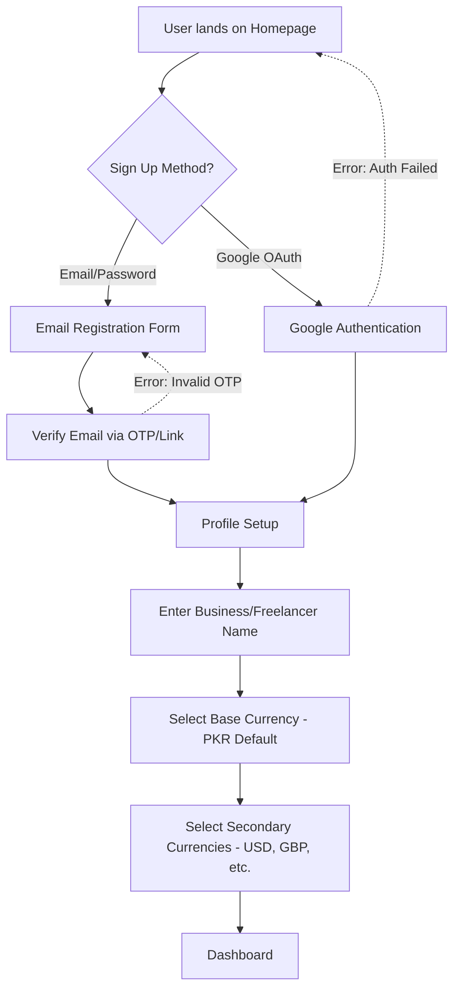
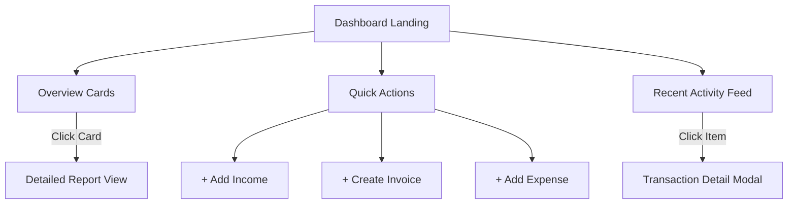
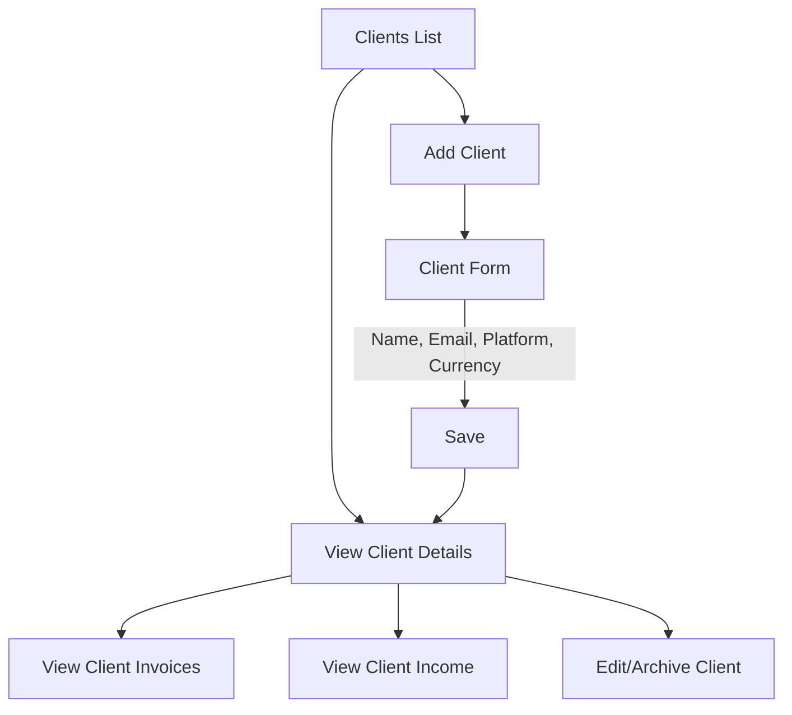
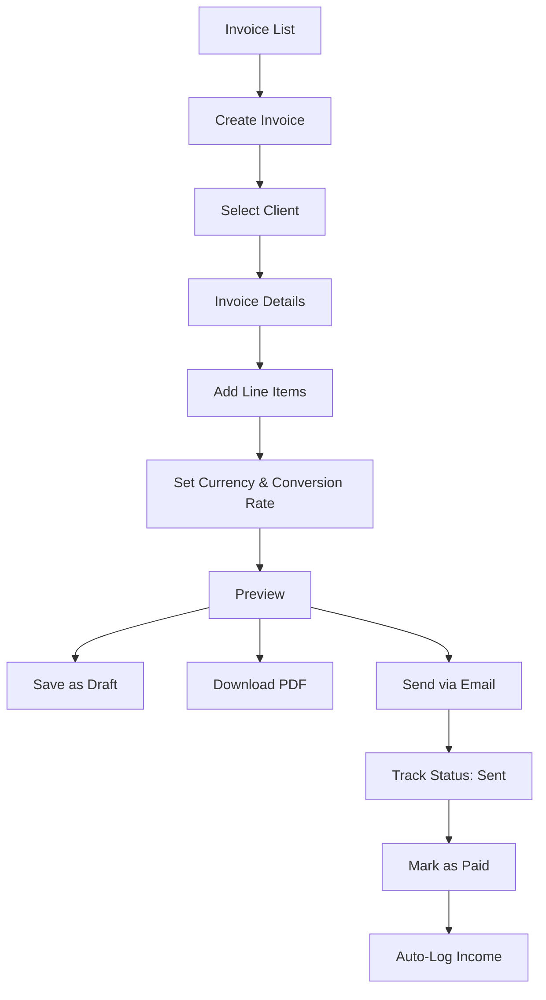
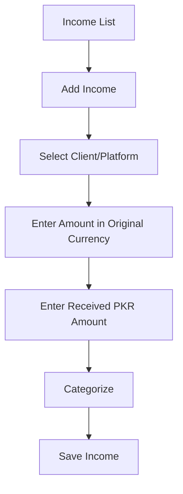
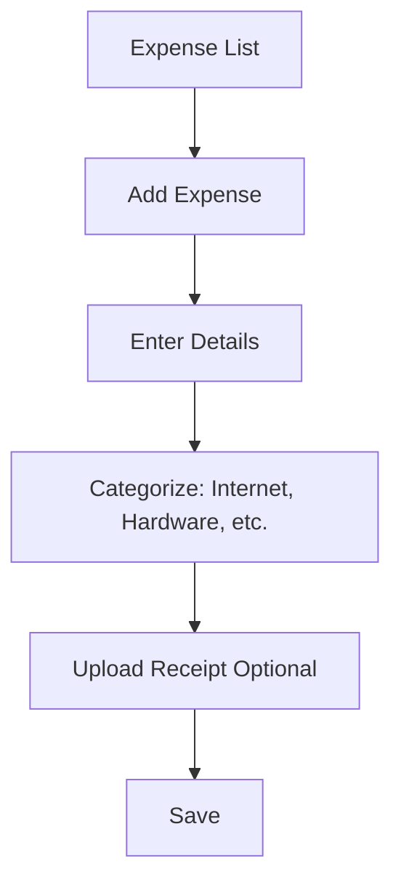
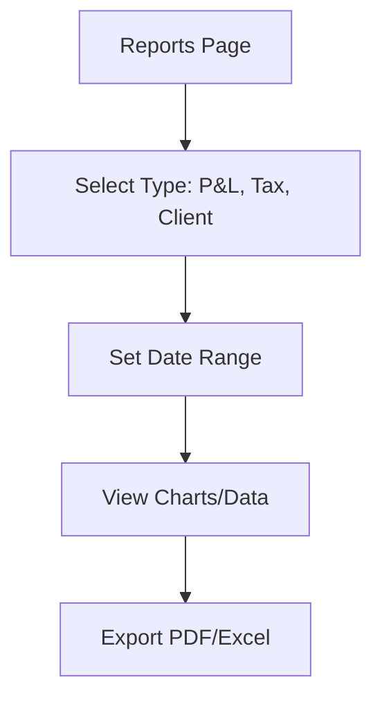
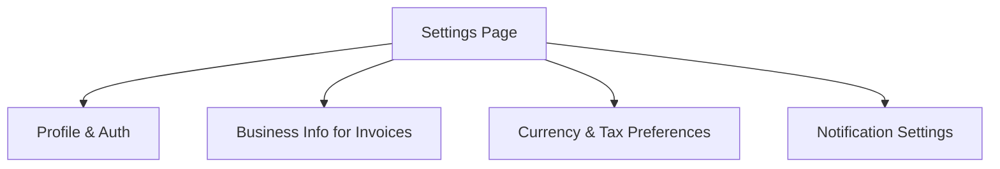

# User Flows: FreelancerHisab

This document outlines the primary user flows for FreelancerHisab, ensuring an intuitive experience tailored for Pakistani freelancers managing multiple currencies, clients, and financial records.

---

## 1. Onboarding Flow

### Detailed Steps:
1. **Sign Up Options**: Provide Google OAuth for quick access, or Email/Password.
2. **Email Verification**: Essential for security and invoice sending capabilities.
3. **Profile Setup**: 
   - Business name will appear on invoices.
   - Base Currency is PKR (important for SBP context).
   - Secondary currencies for receiving international payments (Payoneer, Wise).

### Edge Cases:
- Existing email during registration: Prompt to log in.
- Abandoned profile setup: Force user back to setup on next login before dashboard access.

---

## 2. Dashboard Flow

### Detailed Steps:
1. **Overview Cards**: Show Net Profit, Total Income, Total Expenses, and Pending Invoices for the current month in PKR.
2. **Quick Actions**: Floating Action Button (Mobile) or Top Bar (Desktop) to quickly log an entry.
3. **Recent Activity**: A unified timeline of recent invoices sent, payments received, and expenses logged.

---

## 3. Client Management Flow

### Detailed Steps:
1. **Add Client**: Collect basic info. "Platform" (Fiverr, Upwork, Direct) helps in reporting.
2. **Client Details**: A unified view of how much a specific client has paid and what is outstanding.

---

## 4. Invoice Creation Flow

### Detailed Steps:
1. **Currency/Conversion**: If invoicing in USD, prompt for an expected exchange rate to project PKR value.
2. **Mark as Paid**: When user marks an invoice as paid, prompt them to specify the received amount in PKR to log the exact exchange rate realized.

---

## 5. Income Logging Flow

### Detailed Steps:
1. **Dual Entry**: Freelancers often receive USD but realize PKR. The form must capture both to accurately track bank fees and exchange rates.
2. **Categorize**: E.g., Web Development, Consultation.

---

## 6. Expense Tracking Flow

---

## 7. Report Generation Flow

---

## 8. Settings Flow

