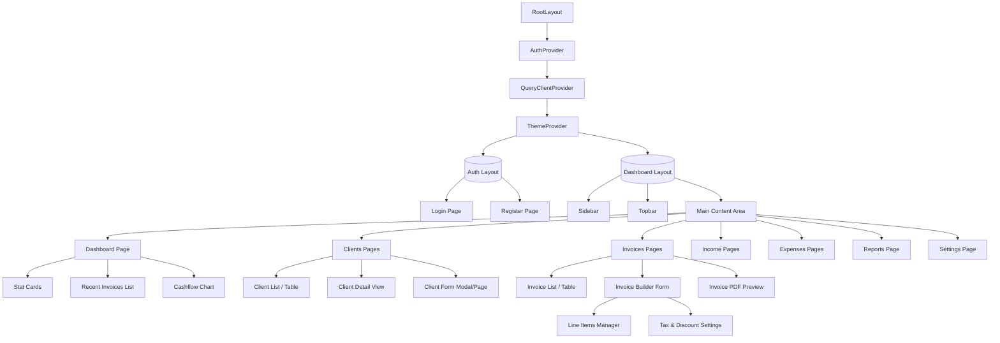

# 07 Component Hierarchy

This document outlines the React component hierarchy for the Next.js frontend (`apps/web/`) of FreelancerHisab, which communicates with the NestJS backend (`apps/api/`).

## 1. Complete Component Tree



## 2. Page-Level Components

All pages are located in `apps/web/src/app/`. Since this is a Turborepo monorepo, the web app focuses solely on UI and calls the NestJS API for data.

- `app/page.tsx` — Landing page or redirect to `/dashboard` or `/login`.
- `app/(auth)/login/page.tsx` — User authentication.
- `app/(auth)/register/page.tsx` — User registration.
- `app/(dashboard)/dashboard/page.tsx` — Overview of business metrics, recent activities.
- `app/(dashboard)/clients/page.tsx` — List of all clients.
- `app/(dashboard)/clients/[id]/page.tsx` — Detailed view of a specific client.
- `app/(dashboard)/invoices/page.tsx` — List of invoices.
- `app/(dashboard)/invoices/new/page.tsx` — Create a new invoice.
- `app/(dashboard)/invoices/[id]/page.tsx` — View/Edit/Send a specific invoice.
- `app/(dashboard)/income/page.tsx` — Income tracking and management.
- `app/(dashboard)/expenses/page.tsx` — Expense tracking and management.
- `app/(dashboard)/reports/page.tsx` — Financial reports and charts.
- `app/(dashboard)/settings/page.tsx` — User profile, preferences, tax settings, bank details.

## 3. Feature Components

### `InvoiceBuilder`
- **Designation:** Client Component (`"use client"`)
- **Props:** `interface InvoiceBuilderProps { initialData?: InvoiceDTO; clients: ClientDTO[]; }`
- **Data Dependencies:** Needs client list for dropdown. Uses Zod for form validation. Submits to NestJS API.
- **Description:** Complex form for creating/editing invoices with dynamic line items.

### `DashboardMetrics`
- **Designation:** Server Component / Client Component mixed (fetches server side, renders client charts).
- **Props:** `interface DashboardMetricsProps { data: DashboardStatsDTO; }`
- **Data Dependencies:** `/api/dashboard/stats` from NestJS.
- **Description:** Displays summary cards (Total Revenue, Outstanding Invoices, PKR formatting).

### `ClientTable`
- **Designation:** Client Component (for pagination/sorting) or Server Component.
- **Props:** `interface ClientTableProps { clients: ClientDTO[]; }`
- **Data Dependencies:** Client list from NestJS API.
- **Description:** Interactive table displaying clients, utilizing shadcn/ui `DataTable`.

### `ExpenseFormModal`
- **Designation:** Client Component
- **Props:** `interface ExpenseFormModalProps { isOpen: boolean; onClose: () => void; onSubmit: (data: ExpenseFormValues) => void; }`
- **Description:** Modal for adding or editing an expense record.

## 4. API Client Layer

The frontend communicates with the NestJS backend via a centralized API client, likely built with `axios` or native `fetch` wrapper.

**`apps/web/src/lib/api-client.ts`:**
- Manages base URL targeting the NestJS server (e.g., `http://localhost:3001`).
- Handles request interceptors to attach the JWT access token.
- Handles response interceptors for global error handling and 401 Unauthorized token refreshing.

```typescript
import axios from 'axios';
import { useAuthStore } from '@/stores/authStore';

export const apiClient = axios.create({
  baseURL: process.env.NEXT_PUBLIC_API_URL,
  headers: {
    'Content-Type': 'application/json',
  },
});

apiClient.interceptors.request.use((config) => {
  const token = useAuthStore.getState().accessToken;
  if (token) {
    config.headers.Authorization = `Bearer ${token}`;
  }
  return config;
});
```

## 5. Auth Provider

Authentication is managed completely via JWTs issued by the NestJS backend.

- **Storage:** Secure HttpOnly cookies (preferred) or `localStorage`/Zustand store.
- **Context/Store:** Zustand store (`authStore.ts`) holds user details and access token in memory.
- **Refresh Logic:** If the API returns a 401, the `apiClient` interceptor automatically calls the `/api/auth/refresh` endpoint on NestJS to get a new access token, then retries the failed request.

## 6. shadcn/ui Components

The following shadcn/ui components need to be installed in `apps/web`:

- `button`, `input`, `textarea` (Forms)
- `card` (Layout & Dashboard widgets)
- `dialog`, `sheet` (Modals, slide-overs)
- `dropdown-menu`, `select` (Actions, forms)
- `table` (Data display)
- `toast`, `sonner` (Notifications)
- `calendar`, `popover` (Date pickers for invoices)
- `badge` (Status indicators, e.g., 'Paid', 'Overdue')
- `avatar` (User profile in topbar)
- `skeleton` (Loading states)
