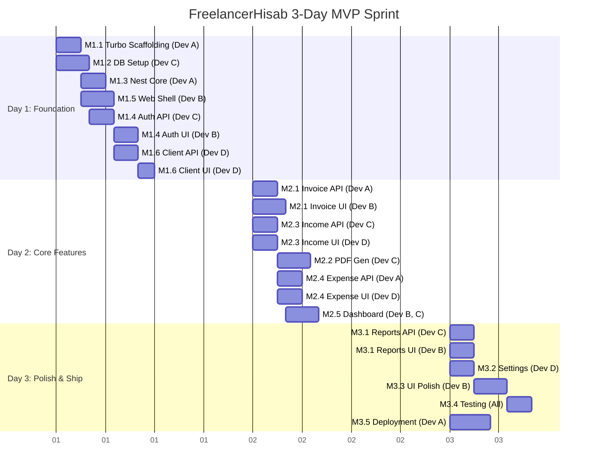

# Development Roadmap (3-Day MVP Sprint)

## Overview
This roadmap outlines the 3-day MVP sprint for FreelancerHisab, utilizing a **Turborepo monorepo** with a **NestJS backend** and **Next.js frontend**. The stack uses **Drizzle ORM** (postgres.js) for database management and **Passport.js JWT** for authentication. The team consists of 4 developers working in parallel to deploy on **Railway** (backend) and **Vercel** (frontend).

### Team Allocation
*   **Dev A (Fullstack Lead):** Architecture, DevOps, complex full-stack features.
*   **Dev B (Frontend Specialist):** Next.js UI, Tailwind, state management.
*   **Dev C (Backend Specialist):** NestJS modules, Drizzle ORM schemas, external APIs.
*   **Dev D (Full-stack Junior):** CRUD endpoints, simple UI components, documentation.

---

## Day 1: Foundation (Milestone 1)

### M1.1: Turborepo Scaffolding
*   **Time Estimate:** 3h
*   **Assigned:** Dev A
*   **Dependencies:** None
*   **Risks:** Monorepo configuration issues (TS paths, linting).
*   **Definition of Done:** `apps/api` (NestJS) and `apps/web` (Next.js) running via `turbo run dev`. Shared `packages/ui` and `packages/config` initialized.

### M1.2: Database Setup
*   **Time Estimate:** 4h
*   **Assigned:** Dev C
*   **Dependencies:** M1.1
*   **Risks:** Schema design flaws leading to complex migrations later.
*   **Definition of Done:** Drizzle ORM configured with postgres.js. Initial migrations for Users, Clients, Invoices created. Seed script running successfully.

### M1.3: NestJS Core
*   **Time Estimate:** 3h
*   **Assigned:** Dev A
*   **Dependencies:** M1.1
*   **Risks:** CORS and validation misconfigurations.
*   **Definition of Done:** Global exception filter, validation pipe, Swagger documentation, and CORS configured.

### M1.4: Auth System
*   **Time Estimate:** 5h
*   **Assigned:** Dev C (API) & Dev B (Web)
*   **Dependencies:** M1.2, M1.3
*   **Risks:** JWT security, cookie handling across domains.
*   **Definition of Done:** NestJS Passport JWT strategy implemented. Next.js login/register pages functional with API integration. Auth context/store created.

### M1.5: Frontend Shell
*   **Time Estimate:** 4h
*   **Assigned:** Dev B & Dev D
*   **Dependencies:** M1.1
*   **Risks:** Responsive layout inconsistencies.
*   **Definition of Done:** Dashboard layout, sidebar, header, theming (shadcn/ui), and React Query API client configured.

### M1.6: Client Management
*   **Time Estimate:** 4h
*   **Assigned:** Dev D
*   **Dependencies:** M1.2, M1.5
*   **Risks:** Form validation logic mismatch between frontend/backend.
*   **Definition of Done:** NestJS CRUD endpoints for Clients. Next.js pages for listing, creating, and editing clients.

---

## Day 2: Core Features (Milestone 2)

### M2.1: Invoice System
*   **Time Estimate:** 6h
*   **Assigned:** Dev A (API) & Dev B (Web)
*   **Dependencies:** M1.6
*   **Risks:** Complex relational data structure for invoice line items.
*   **Definition of Done:** Full CRUD for invoices including line items and status tracking.

### M2.2: Invoice PDF
*   **Time Estimate:** 4h
*   **Assigned:** Dev C
*   **Dependencies:** M2.1
*   **Risks:** PDF generation performance and styling.
*   **Definition of Done:** NestJS endpoint returning a generated PDF buffer/stream for an invoice.

### M2.3: Income Tracking
*   **Time Estimate:** 4h
*   **Assigned:** Dev C (API) & Dev D (Web)
*   **Dependencies:** M1.4
*   **Risks:** PKR/USD currency conversion logic.
*   **Definition of Done:** Income module with currency handling (PKR default) and Next.js interfaces.

### M2.4: Expense Tracking
*   **Time Estimate:** 5h
*   **Assigned:** Dev A (API) & Dev D (Web)
*   **Dependencies:** M1.4
*   **Risks:** Receipt file upload handling.
*   **Definition of Done:** Expense endpoints with file upload support (local/S3). Next.js expense lists and forms.

### M2.5: Dashboard API & Widgets
*   **Time Estimate:** 4h
*   **Assigned:** Dev B (Web) & Dev C (API)
*   **Dependencies:** M2.1, M2.3, M2.4
*   **Risks:** Expensive database aggregation queries.
*   **Definition of Done:** Aggregated statistics endpoint (NestJS) and rendering of metric cards/charts (Next.js).

---

## Day 3: Polish & Ship (Milestone 3)

### M3.1: Reports
*   **Time Estimate:** 4h
*   **Assigned:** Dev A (API) & Dev B (Web)
*   **Dependencies:** M2.5
*   **Risks:** Chart rendering performance.
*   **Definition of Done:** Monthly/Yearly summary API and Recharts-based frontend reports.

### M3.2: Settings Page
*   **Time Estimate:** 3h
*   **Assigned:** Dev D
*   **Dependencies:** M1.4
*   **Risks:** Unintended profile overwrites.
*   **Definition of Done:** User profile updates, password change, and business settings updated via API.

### M3.3: UI Polish
*   **Time Estimate:** 4h
*   **Assigned:** Dev B
*   **Dependencies:** M2.1, M2.3, M2.4
*   **Risks:** Scope creep on design perfection.
*   **Definition of Done:** Loading skeletons, toast notifications, empty states, and standard error handling across all views.

### M3.4: Testing & Bug Fixes
*   **Time Estimate:** 4h
*   **Assigned:** All Devs
*   **Dependencies:** All features
*   **Risks:** Critical bugs delaying launch.
*   **Definition of Done:** Core flows (Signup -> Add Client -> Create Invoice -> Pay Invoice) manually tested and verified.

### M3.5: Deployment
*   **Time Estimate:** 4h
*   **Assigned:** Dev A
*   **Dependencies:** M1.1
*   **Risks:** Environment variables misconfiguration, build failures in monorepo context.
*   **Definition of Done:** NestJS API deployed to Railway, PostgreSQL database provisioned on Railway, Next.js web app deployed to Vercel. CI/CD pipelines active.

---

## Gantt Chart

