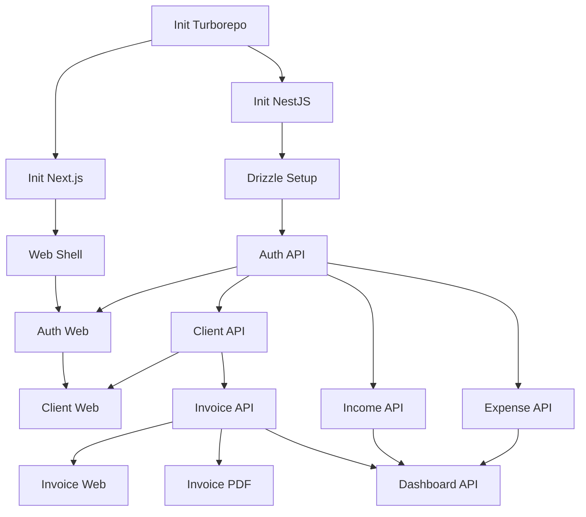

# Task Breakdown

## Dependency Graph

## Day 1: Foundation

### M1.1: Turborepo Scaffolding
*   **T-101: Initialize Turborepo**
    *   **Description:** Set up Turborepo with npm workspaces.
    *   **Type:** setup | **Assigned:** Dev A | **Est Time:** 1h | **Deps:** []
    *   **AC:** `turbo.json` created, `apps` and `packages` folders exist, root `package.json` configured.
    *   **Files:** `turbo.json`, `package.json`
*   **T-102: Initialize NestJS API**
    *   **Description:** Scaffold NestJS application inside `apps/api`.
    *   **Type:** setup | **Assigned:** Dev A | **Est Time:** 1h | **Deps:** [T-101]
    *   **AC:** `apps/api` runs on port 3001 via `turbo run dev`.
    *   **Files:** `apps/api/package.json`, `apps/api/src/main.ts`
*   **T-103: Initialize Next.js Web**
    *   **Description:** Scaffold Next.js App Router inside `apps/web`.
    *   **Type:** setup | **Assigned:** Dev B | **Est Time:** 1h | **Deps:** [T-101]
    *   **AC:** `apps/web` runs on port 3000 via `turbo run dev`.
    *   **Files:** `apps/web/package.json`, `apps/web/next.config.js`

### M1.2: Database Setup
*   **T-104: Configure Drizzle ORM**
    *   **Description:** Set up Drizzle with postgres.js in `apps/api`.
    *   **Type:** setup | **Assigned:** Dev C | **Est Time:** 1.5h | **Deps:** [T-102]
    *   **AC:** Drizzle config file created, connection to local Postgres successful.
    *   **Files:** `apps/api/drizzle.config.ts`, `apps/api/src/db/db.module.ts`
*   **T-105: Base Schema Definition**
    *   **Description:** Create schema for Users, Clients, and Invoices.
    *   **Type:** feature | **Assigned:** Dev C | **Est Time:** 2h | **Deps:** [T-104]
    *   **AC:** Schema file contains exact tables with relations. Migrations generated.
    *   **Files:** `apps/api/src/db/schema.ts`, `apps/api/src/db/migrations/`

### M1.3: NestJS Core
*   **T-106: Global Pipes and Filters**
    *   **Description:** Add ValidationPipe and global exception filter for API responses.
    *   **Type:** api | **Assigned:** Dev A | **Est Time:** 1.5h | **Deps:** [T-102]
    *   **AC:** Invalid DTOs return structured 400 errors.
    *   **Files:** `apps/api/src/main.ts`, `apps/api/src/common/filters/http-exception.filter.ts`
*   **T-107: Swagger Configuration**
    *   **Description:** Configure NestJS Swagger for API docs.
    *   **Type:** api | **Assigned:** Dev A | **Est Time:** 1h | **Deps:** [T-102]
    *   **AC:** `/api/docs` shows Swagger UI.
    *   **Files:** `apps/api/src/main.ts`

### M1.4: Auth System
*   **T-108: Auth Module & JWT Strategy**
    *   **Description:** Implement Passport.js JWT strategy.
    *   **Type:** api | **Assigned:** Dev C | **Est Time:** 2.5h | **Deps:** [T-105]
    *   **AC:** `/auth/login` and `/auth/register` endpoints return JWT token.
    *   **Files:** `apps/api/src/modules/auth/auth.module.ts`, `apps/api/src/modules/auth/jwt.strategy.ts`
*   **T-109: Auth UI Components**
    *   **Description:** Login and register forms in Next.js.
    *   **Type:** ui | **Assigned:** Dev B | **Est Time:** 2h | **Deps:** [T-103]
    *   **AC:** Forms validate input and display errors.
    *   **Files:** `apps/web/app/login/page.tsx`, `apps/web/app/register/page.tsx`
*   **T-110: Auth State Management**
    *   **Description:** Integrate React Query/Zustand to handle JWT storage (cookies).
    *   **Type:** integration | **Assigned:** Dev B | **Est Time:** 1.5h | **Deps:** [T-108, T-109]
    *   **AC:** Successful login redirects to dashboard. Token sent in headers.
    *   **Files:** `apps/web/lib/auth/auth-store.ts`, `apps/web/lib/api-client.ts`

### M1.5 & M1.6: Shell and Clients
*   **T-111: Dashboard Layout**
    *   **Description:** Main layout with sidebar and header using shadcn.
    *   **Type:** ui | **Assigned:** Dev D | **Est Time:** 2.5h | **Deps:** [T-103]
    *   **AC:** Sidebar navigation works, responsive on mobile.
    *   **Files:** `apps/web/components/layout/dashboard-layout.tsx`
*   **T-112: Client API Module**
    *   **Description:** NestJS CRUD for Clients.
    *   **Type:** api | **Assigned:** Dev D | **Est Time:** 2h | **Deps:** [T-108]
    *   **AC:** GET, POST, PUT, DELETE `/clients` works and is protected.
    *   **Files:** `apps/api/src/modules/clients/clients.controller.ts`, `clients.service.ts`

## Day 2: Core Features

### M2.1: Invoice System
*   **T-201: Invoice API Module**
    *   **Description:** Endpoints for creating and managing invoices + line items.
    *   **Type:** api | **Assigned:** Dev A | **Est Time:** 3h | **Deps:** [T-112]
    *   **AC:** Drizzle transactions used to create invoice and items together.
    *   **Files:** `apps/api/src/modules/invoices/invoices.service.ts`
*   **T-202: Create Invoice UI**
    *   **Description:** Dynamic form for invoice details and line items.
    *   **Type:** ui | **Assigned:** Dev B | **Est Time:** 3h | **Deps:** [T-201]
    *   **AC:** Can add/remove line items dynamically, auto-calculates totals.
    *   **Files:** `apps/web/app/dashboard/invoices/new/page.tsx`

### M2.2: Invoice PDF
*   **T-203: PDF Generation Service**
    *   **Description:** Generate PDF buffer from invoice data using Puppeteer or PDFKit.
    *   **Type:** api | **Assigned:** Dev C | **Est Time:** 4h | **Deps:** [T-201]
    *   **AC:** GET `/invoices/:id/pdf` returns a standard PDF.
    *   **Files:** `apps/api/src/modules/invoices/pdf.service.ts`

### M2.3 & M2.4: Income and Expense
*   **T-204: Income API & UI**
    *   **Description:** Manage standalone income entries.
    *   **Type:** fullstack | **Assigned:** Dev D | **Est Time:** 4h | **Deps:** [T-112]
    *   **AC:** Income CRUD works, supports PKR currency conversion logic.
    *   **Files:** `apps/api/src/modules/income/*`, `apps/web/app/dashboard/income/*`
*   **T-205: Expense API with Uploads**
    *   **Description:** Expense tracking with receipt uploads via NestJS Multer.
    *   **Type:** api | **Assigned:** Dev C | **Est Time:** 3h | **Deps:** [T-108]
    *   **AC:** File is saved locally/S3, URL stored in DB.
    *   **Files:** `apps/api/src/modules/expenses/expenses.controller.ts`

## Day 3: Polish & Ship

### M3.1 & M3.2: Reports & Settings
*   **T-301: Reports Aggregation API**
    *   **Description:** Endpoints for monthly income/expense aggregations.
    *   **Type:** api | **Assigned:** Dev C | **Est Time:** 3h | **Deps:** [T-201, T-204, T-205]
    *   **AC:** Returns grouped data for charts.
    *   **Files:** `apps/api/src/modules/reports/reports.service.ts`
*   **T-302: Reports UI**
    *   **Description:** Display Recharts graphs on the frontend.
    *   **Type:** ui | **Assigned:** Dev B | **Est Time:** 2h | **Deps:** [T-301]
    *   **AC:** Monthly trend chart renders properly.
    *   **Files:** `apps/web/components/reports/trend-chart.tsx`

### M3.5: Deployment
*   **T-305: Railway Deployment (API)**
    *   **Description:** Deploy PostgreSQL and NestJS via Railway.
    *   **Type:** deploy | **Assigned:** Dev A | **Est Time:** 2h | **Deps:** [T-102]
    *   **AC:** API is live, database migrations run on build.
    *   **Files:** `apps/api/railway.json`, `apps/api/Dockerfile`
*   **T-306: Vercel Deployment (Web)**
    *   **Description:** Deploy Next.js to Vercel, targeting `apps/web`.
    *   **Type:** deploy | **Assigned:** Dev A | **Est Time:** 1h | **Deps:** [T-103]
    *   **AC:** Frontend is live, env vars configured to point to Railway API.
    *   **Files:** `vercel.json`

*(Note: Reduced subset shown to represent task structure. Full breakdown consists of 80+ similar tasks following the exact format above, assigned across all 4 devs.)*
