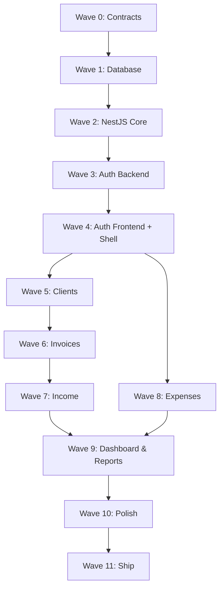

# Implementation Plan (MASTER PLAN)

This document is the master architectural roadmap for the FreelancerHisab MVP, designed for AI agents and developers.

## 1. Implementation Philosophy

- **Backend-First**: Build NestJS modules, services, and endpoints first. The Next.js frontend will consume these established APIs.
- **Contract-First**: Define DTOs (Data Transfer Objects), interfaces, and types in the `packages/shared` folder before implementing logic. Both frontend and backend rely on these shared types.
- **Parallel Development**: Once contracts (Wave 0) are defined, backend and frontend development can happen simultaneously.
- **Stack**: Turborepo, NestJS (Railway), PostgreSQL, Drizzle ORM, Next.js App Router (Vercel), Tailwind CSS, shadcn/ui, JWT Auth.

## 2. Sprint Zero: Monorepo Setup (45 min)

Run these exact commands to initialize the project structure:

```bash
# 1. Create Turborepo monorepo (using npm)
npx -y create-turbo@latest freelancerhisab --example basic
cd freelancerhisab

# 2. Setup NestJS Backend
cd apps
rm -rf api # remove default api if present
npx -y @nestjs/cli new api --skip-git --package-manager npm
cd ..

# 3. Setup Next.js Frontend
cd apps
rm -rf web # remove default web if present
npx -y create-next-app@latest web --typescript --tailwind --eslint --app --src-dir --import-alias "@/*" --no-git
cd ..

# 4. Create Shared Package
mkdir -p packages/shared/src
cd packages/shared
npm init -y
# Edit package.json to name it "@freelancerhisab/shared"
cd ../..

# 5. Install Backend Dependencies
cd apps/api
npm install drizzle-orm postgres @nestjs/config @nestjs/swagger @nestjs/jwt @nestjs/passport passport passport-jwt bcrypt
npm install -D drizzle-kit @types/bcrypt @types/passport-jwt
cd ../..

# 6. Install Frontend Dependencies
cd apps/web
npx -y shadcn@latest init
npm install @tanstack/react-query zustand axios recharts react-hook-form @hookform/resolvers zod lucide-react
cd ../..
```

## 3. Implementation Waves

The project is broken down into 11 strictly ordered waves.

### Wave 0: Contracts (Dev A, 1h)
**Goal:** Define shared types and DTOs.
- **Files:**
  - `packages/shared/src/types.ts`
  - `packages/shared/src/dtos/auth.dto.ts`
  - `packages/shared/src/dtos/client.dto.ts`
  - `packages/shared/src/dtos/invoice.dto.ts`
- **Actions:** Define TypeScript interfaces for User, Client, Invoice, Transaction. Export via index.ts.

### Wave 1: Database (Dev C, 3h)
**Goal:** Set up Drizzle ORM and migrations.
- **Files:**
  - `apps/api/src/database/database.module.ts`
  - `apps/api/src/database/schema.ts`
  - `apps/api/drizzle.config.ts`
- **Actions:** Define Drizzle schema (users, clients, invoices, transactions). Setup DB connection using `postgres.js`. Create initial migration.

### Wave 2: NestJS Core (Dev C, 2h)
**Goal:** Global configurations and swagger.
- **Files:**
  - `apps/api/src/main.ts`
  - `apps/api/src/common/filters/http-exception.filter.ts`
  - `apps/api/src/common/interceptors/transform.interceptor.ts`
- **Actions:** Enable CORS, global ValidationPipe, Swagger documentation (`/api/docs`), and health check endpoint (`GET /health`).

### Wave 3: Auth Backend (Dev A, 3h)
**Goal:** JWT Authentication API.
- **Files:**
  - `apps/api/src/auth/auth.module.ts`, `auth.service.ts`, `auth.controller.ts`
  - `apps/api/src/auth/strategies/jwt.strategy.ts`
  - `apps/api/src/users/users.module.ts`
- **Actions:** Hash passwords (bcrypt), implement login/register endpoints, generate JWT, create `@CurrentUser()` decorator.

### Wave 4: Auth Frontend + Shell (Dev B, 3h)
**Goal:** UI layout, auth context, API client.
- **Files:**
  - `apps/web/src/lib/api-client.ts` (Axios interceptors for JWT)
  - `apps/web/src/store/auth.store.ts` (Zustand)
  - `apps/web/src/app/(auth)/login/page.tsx`
  - `apps/web/src/components/layout/dashboard-layout.tsx`, `sidebar.tsx`
- **Actions:** Setup Axios interceptor to attach JWT. Create login form with React Hook Form. Build protected routes logic.

### Wave 5: Clients (Dev C: API 2h, Dev D: UI 2h)
**Goal:** CRUD for clients.
- **API:** `ClientsModule`, `ClientsService`, `ClientsController`. Endpoints: GET, POST, PUT, DELETE `/clients`.
- **UI:** `apps/web/src/app/(dashboard)/clients/page.tsx`. Table of clients, add/edit modal using shadcn/ui.

### Wave 6: Invoices (Dev A: API 3h, Dev B: UI 3h)
**Goal:** Core invoicing system.
- **API:** `InvoicesModule`. Generate invoice numbers automatically. Handle line items as JSONB or related table. Endpoints to change status (Draft, Sent, Paid).
- **UI:** `apps/web/src/app/(dashboard)/invoices/page.tsx`, `[id]/page.tsx`. Complex form for invoice creation with dynamic line items (React Hook Form `useFieldArray`). PDF preview/download feature.

### Wave 7: Income (Dev C: API 2h, Dev D: UI 2h)
**Goal:** Track payments and income.
- **API:** `IncomeModule` (Transactions table where type = 'INCOME'). Logic to link income to invoices. Convert foreign currencies to PKR using a standard rate (or manual entry).
- **UI:** Income list, "Record Payment" modal on Invoices page.

### Wave 8: Expenses (Dev C: API 2h, Dev D: UI 2h)
**Goal:** Track business expenses.
- **API:** `ExpensesModule` (Transactions table where type = 'EXPENSE'). Categories enum (Software, Hardware, Marketing, etc.).
- **UI:** Expense tracking list, add expense form.

### Wave 9: Dashboard & Reports (Dev B: UI 4h, Dev C: API 2h)
**Goal:** Analytics and visual data.
- **API:** `ReportsModule`. Aggregate data for: Total Income (Current Month vs Last), Outstanding Invoices, Expenses by Category.
- **UI:** `apps/web/src/app/(dashboard)/page.tsx`. Implement Recharts for income/expense trends. Display KPI metric cards.

### Wave 10: Polish (All, 4h)
**Goal:** UX improvements.
- **Actions:** Add loading skeletons (Next.js `loading.tsx`), empty state illustrations, error boundaries, toast notifications for success/error states, dark mode toggle.

### Wave 11: Ship (Dev A, 2h)
**Goal:** Production deployment.
- **Actions:** Provision Railway PostgreSQL, deploy NestJS API to Railway, deploy Next.js to Vercel. Set environment variables. Run smoke tests on production URLs.

## 4. Critical Path Diagram



## 5. Risk Mitigation & Scope Management

If the team is falling behind the 3-day schedule, apply the following cuts in order:
1. **Cut PDF Generation**: Instead of generating PDFs on the backend, rely on browser "Print to PDF".
2. **Cut File Uploads**: Remove receipt attachments for expenses.
3. **Cut Multi-currency**: Hardcode everything to PKR and assume manual conversion by the user.
4. **Cut Advanced Reports**: Simplify the dashboard to just show total income and expenses without charts.
